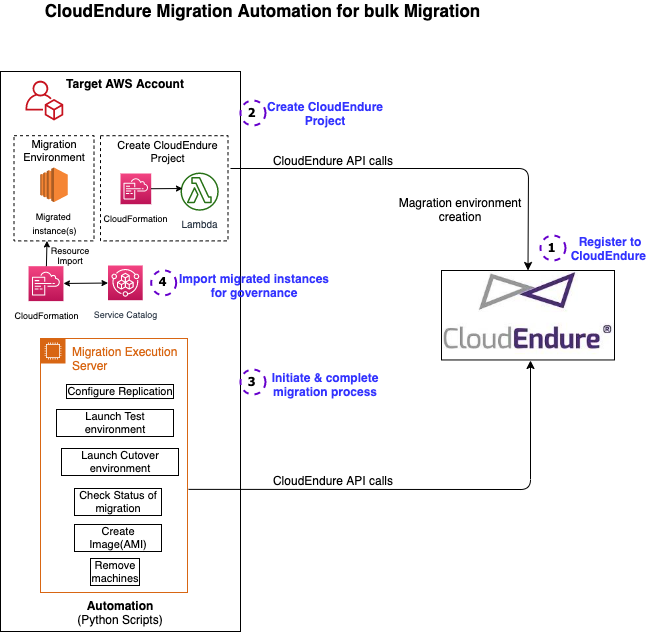

# Automated bulk AWS migration using CloudEndure & adoption of migrated servers into ServiceCatalog products
Generally as a part of migration we want to migrate the application ecosystem. We select applications and start migrating them one by one.
This project is built for the same purpose, where you will select a specific application with number of servers for migration.
You can select the specific application servers to migrate and after migration, you might re-architect the application hosted on them as per your modernization road map.

It includes templates and scripts to automate the aws migration using CloudEndure.
This solution is ideal for bulk migration of 2 to 25+ servers in one go.

With this approach the servers are migrated in batches which is called as migration 'wave'.

If you have 50+ servers, it is recommended to use the Migration factory solution mentioned here https://docs.aws.amazon.com/solutions/latest/aws-cloudendure-migration-factory-solution/welcome.html

The python scripts are referenced from the [automating-aws-migration-with-cloudendure-scripts](https://github.com/aws-samples/automating-aws-migration-with-cloudendure-scripts) samples. 

**The script will return an error if one of the following conditions is met:**

*The major advantage of this solution is, with CloudEndure console you can not enforce some of the below mentioned checks which are very useful when you want to migrate many servers.*

- Launch type is cutover but the server has not been migrated to the test environment.
- Launch type is cutover but the server has been migrated to the production environment already.
- Clean up servers before cutover completes.
- Migrate a server with more than 180 minutes lag.
- Use an incorrect machine name or project name.
- Launch a machine that hasn’t completed the initial replication.

## Automated management of servers after migration using CloudFormation import and ServiceCatalog adoption

Once the servers are migrated to AWS, you can import those servers into cloudFormation stack. And then ServiceCatalog products can be created from it.
Hence you can now add Service Catalog governance to the migrated servers. Once imported into Service Catalog, administrators can manage stack updates, govern parameters, and enforce tagging. Also you can add/update the additional parameters to the migrated server such as Security group, IAM roles, tags etc. in automated way.
More details can be found 1. [here](https://aws.amazon.com/blogs/aws/new-import-existing-resources-into-a-cloudformation-stack/) & 2. [here](https://aws.amazon.com/about-aws/whats-new/2020/11/aws-customer-can-now-use-aws-service-catalog-stack-import-to-add-governance/)

## Prerequisites

1. Experience with the CloudEndure service, installing the agent, and using it from the console. Learn more about [how to use CloudEndure](https://docs.cloudendure.com/).
2. CloudEndure account created. Fill the simple form to create CloudEndure account and note the credentials used. [Get started now with free CloudEndure Migration licenses](https://migration-register.cloudendure.com/). CloudEndure migration licenses are provided at no cost for customers and partners.
3. Target AWS account to migrate the servers.
We recommend to use the [AWS Control Tower](https://docs.aws.amazon.com/controltower/latest/userguide/what-is-control-tower.html) to manage the AWS multi-accounting environment. You can [plan and setup](https://docs.aws.amazon.com/controltower/latest/userguide/planning-your-deployment.html) the landing zone. The [AWS Organizations](https://aws.amazon.com/organizations/) will be used to effectively manage and structure the accounts as per requirements in Organization units. 

## Architecture

## Files and their purpose

- **config-cutover.yml** – The config file for the production environment.
- **config-test.yml** – Config file for the test environment.
- **config-project.yml** – Config file for project replication settings.
- **CloudEndure.py** – Master Python script to drive the orchestration process.
- **CheckMachine.py** – Python script to check the status of the machine before migration.
- **LaunchMachine.py** – Python script to launch the machine in a test or production environment.
- **Machine.py** – Python script to call three other functions: check status, update blueprint, and launch target machines.
- **StatusCheck.py** – Python script to check the migration status of the target machine.
- **UpdateBlueprint.py** – Python script to update the machine blueprint, such as security group, subnet ID, tags, etc.
- **UpdateProject.py** – The Python script to update settings for the replication server, such as encryption key, security group ID, and subnet ID.
- **Cleanup.py** – Python script to remove machines from CloudEndure after cut over.
- **CreateCloudEndureProject.yml** - CloudFormation to create the CloudEndure project and AWS resources in target AWS account. 
- **MigrationExecutionServer.yml** - CloudFormation template to launch the Migration Execution server.

## Terminologies
- **Source machine(s)** - Server(s) which are intended to migrate on AWS
- **Target account** - AWS account where the source servers will be migrated & most part of this solution will run

## Migration Steps

Assuming that you want to migrate the servers in single target AWS account, below are the steps to follow.
If you have servers to be migrated in different AWS accounts, please repeat below steps for each aws account.

### 1. Create CloudEndure project
- Login to **target AWS account** and switch to correct region.
- Download the CloudEndureProjectLambda Lambda zip file from below link. https://marketplace-sa-resources.s3.amazonaws.com/ctlabs/migration/CloudEndureProjectLambda.zip
- Create a s3 bucket to upload the Lambda function zip file. This bucket will be referred in next step.
- Download the file **CreateCloudEndureProject.yml** from above list of files.
- Navigate to AWS CloudFormation console and **Create Stack** using the cloudformation template(from the repo) **CreateCloudEndureProject.yml**. Pass the above bucket name as a parameter for lambda code.
- Once the stack is created, it will create a CloudEndure project, IAM user & KMS key in AWS account. Note the KMS Key ARN from stack output.
- The created CloudEndure project will be linked to the AWS account from which it is created. 

### 2. Create Migration execution server
- Download the file **MigrationExecutionServer.yml** from above list of files.
- Make sure you are in **Target AWS account** with correct region. Create stack using CloudFormation template(from the repo) **MigrationExecutionServer.yml**. This will launch a Amazon Linux ec2 instance with required migration scripts. Make sure this server has access to internet to copy the 
scripts from the github repository as well as to call the CloudEndure APIs.
- The migration scripts(from the github) will be downloaded at bootstrapping of the ec2 at the location `/home/ec2-user/`.

### 3. Config files preparation
- Make sure you already have a target VPC created in target AWS account where you will migrate the servers. Identify the public and private subnets where target servers will be launched.
- Please change below configuration files on the Migration execution server we launched in previous step.
- Login to Migration Execution server via ssh with EC2 key and user as `ec2-user`. Change directory to `/home/ec2-user/bulk-aws-migration-using-cloudendure-automation-main`. (If you don't see the repository folder then please download using below command.)
`wget https://github.com/aws-samples/bulk-aws-migration-using-cloudendure-automation/archive/main.zip` 
- **config-projects.yml** - To update the Replication Settings, edit this file with subnetID(Get from VPC console), target encryption key, securitygroupIDs. Get the securitygroupIDs value from step#1 cloudformation stack output section.
- **config-test.yml** - Edit this file to add test server details. Update the subnet and security group IDs for the test environment(copy from target AWS account). The machine count and machine numbers sections(ex. machine1...n) MUST be in synch.
- **config-cutover.yml** - Edit this file to add Production server details. Need to change the security groups and subnet IDs to the one in your production VPC. This file is similar to the Config-test.yml but will have final configuration of the servers'(end migration state). The machine count and machine numbers sections(ex. machine1...n) MUST be in synch.
- Make sure that all the config files are updated with correct data as they will be used in next steps.

### 4. Create Replication settings & Generate API token
- Login to CloudEndure and in **Setup & Info** > **Replication Settings**, configure fields like **Migration Source** to 'Other Infrastructure', **Migration Target** to the AWS region where the target machine should be migrated, **Replication Server instance type** to Default or any other type you want, **Converter instance type** to Default, check **dedicated Replication Server** option and keep other things as it is and click **SAVE REPLICATION SETTINGS** button. We will change the Subnet, Security group and Encryption Key in next step via script.
- In CloudEndure console, click **Setup & Info** and choose **OTHER SETTINGS**. Copy and note the project name for next steps. Next, scroll down to the bottom. If the **API token** does not exist, click the **Generate New** Token button at the right bottom. Copy and note the API Token. Do not use the installation token, which is for agent installation only. Now the CloudEndure initial settings are complete.
- Next, update the Replication settings via scripts. Login to Migration Execution server and run \
`python3 CloudEndure.py --userapitoken <APIToken> --projectname <project name> --configfile config-projects.yml --updateproject Yes`

### 5. Install CloudEndure Agent
- Go to CloudEndure and click on **Machines**. Copy the agent installation commands for source machines depending on the OS type.
- Goto the migration source machines and install the CloudEndure agent on each of them.
- As soon as the agent is installed, the machine will start the replication to CloudEndure. These machines will start appearing on the CloudEndure console. Make sure that all the servers of that 'wave' appear on CloudEndure. If not recheck that the agent is installed successfully and the server has egress(firewall) rule open to connect to CloudEndure.
- **Wait** until the DATA REPLICATION PROGRESS show as 'Continuous Data Replication'. This might take 15 minutes to 120 minutes, depending on the size of server, bandwidth etc. This is indication to carry next steps.

### 6. Launch Test environment
(Run on Migration Execution server)
- Before Test environment launch, validate the YAML syntax with dry run. \
`python3 CloudEndure.py --userapitoken <APIToken> --projectname <project name> --configfile config-test.yml --launchtype test --dryrun Yes`
- Launch the Test environment \
`python3 CloudEndure.py --userapitoken <APIToken> --projectname <project name> --configfile config-test.yml --launchtype test`
- Check the status of launch \
`python3 CloudEndure.py --userapitoken <APIToken> --projectname <project name> --configfile config-test.yml --launchtype test --statuscheck Yes`
(The progress is also visible on CloudEndure console > Job progress)
- When Test environment launch is complete, go to the target AWS account and test the servers, applications on it. If everything is OK, move ahead to launch the production environment(final).

### 7. Launch the Production Environment
 Like above, run the below commands on Migration Execution server for final end state Production environment.

- Validate YAML file syntax \
`python3 CloudEndure.py --userapitoken <APIToken> --projectname <project name> --configfile config-cutover.yml --launchtype cutover --dryrun Yes`
- Launch the Production environment  \
`python3 CloudEndure.py --userapitoken <APIToken> --projectname <project name> --configfile config-cutover.yml --launchtype cutover`
- Check the status of launch \
`python3 CloudEndure.py --userapitoken <APIToken> --projectname <project name> --configfile config-cutover.yml --launchtype cutover --statuscheck Yes`
(The progress is also visible on CloudEndure console > Job progress)
- Test the final production servers for application functionality. 

### 8. Create Images(AMI) of migrated servers
Once you confirm that the servers are migrated correctly, use below command to create the images(AMI) of them.
- Goto migration execution server and run below command \
`python3 CloudEndure.py --userapitoken <APIToken> --projectname <project name> --configfile config-cutover.yml --createimage Yes --region <aws_region>`
- This will trigger the image creation for all the servers in that wave which are launched in 'cutover' mode. You can check the **AWS ec2 console > AMIs** for the list of images. The images are named after the server names it created from and also contains additional tags for identification.
- These images will be used in further steps to create the CloudFormation stacks of the migrated servers. 

### 9. Create the CloudFormation template for migrated servers
Once the servers are migrated to AWS, we recommend to manage them with automation using CloudFormation and AWS ServiceCatalog. As AWS CloudFormation provides the functionality to adopt the existing resources as a CloudFormation template, you can manage these migrated server as Infrastructure as a code(IaaC). The CloudFormation stack will be used to create the Service Catalog product to provide self-service functionality. Also you can configure more parameters for the migrated server via CloudFormation and ServiceCatalog. Also this can be used to replicate the migrated servers as needed.
 - To create the CloudFormation stack for each server migrated, use the file **MigratedEc2Import.yml** and edit as per the current and required configurations for that particular migrated instance. 
 - In target AWS account, goto **CloudFormation > Create Stack > With existing resources (import resources)**. Progress through the wizard. In second screen, specify the template which was edited in earlier step.
 - In **Identify Resources** screen, enter the network interface id and EC2 instance id of the instance for which you are created the stack.
 - In **Specify stack details** window enter the additional details for the ec2 instance. These details will be same from the current ec2 instance. But the image id should be taken from the image we created in previous step. Click Next.
 - Review the **Import overview** screen and click on **Import resources**. This will trigger the import stack creation.
 - If everything goes well, you will see the status as **IMPORT_COMPLETE** which means success.
 - Goto the Stack info tab and copy the Stack ID. We will use the stack ID of the above imported stack to create the ServiceCatalog product.
 - To create the import stack for each migrated server, repeat the above steps for each one of them. This will create as many imported stack as you have migrated servers.
 
### 10. Create ServiceCatalog Portfolio and product
- Goto **ServiceCatalog** console in target AWS account. From the left panel goto **Administration** > **Products**. On right side, click on **Upload new product**.
- Fill the Product name and all the details. In **Version details** section , choose **Use an existing Cloudformation Stack**.
- Enter the ARN of CloudFormation stack ID copied in earlier steps. Fill the remaining details and create the product.
- Then from the left panel , click on **Portfolios** and create a portfolio if you don't have any. 
- Click on the new portfolio and on the **Products** tab, click on **Add product to portfolio**. Select the product we created in earlier step and add it to portfolio.
- Click on that portfolio and assign the correct permission(user, role) to it from the tab **Groups, roles, and users**. This will enable the assigned end users/roles to launch the product inside it.
- You need to repeat above steps for each product you created(i.e. for each migrated server). You can add all the products in single portfolio or create separate portfolio depending upon your structure.
- Once all the servers are imported with CloudFormation and have their ServiceCatalog products ready, the end users can go and launch them if needed. With this method you can bring the migrated servers under the governance with automated administration. 

### 11. Clean up
- After complete migration, run the following command to remove machines from the CloudEndure console. This command will not terminate machines from AWS. \
`python3 CloudEndure.py --userapitoken <APIToken> --projectname <project name> --configfile config-cutover.yml --cleanup Yes`
- If you have DONE with all your servers migrated to AWS, you can delete the CloudFormation stack for CloudEndureProject creation(step# 1) and Migration execution Server(step# 2) stack.
- Also it is safe to terminate the CloudEndure Replication servers(ec2) which are running in target account.

## Security

See [CONTRIBUTING](CONTRIBUTING.md#security-issue-notifications) for more information.

## License Summary
This sample code is made available under the MIT-0 license. See the LICENSE file.